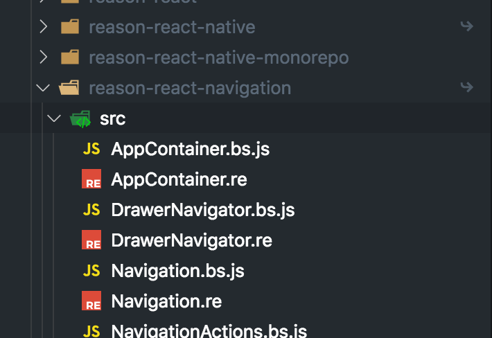

# Error

This is the screen error saying "Unable to resolve module reason-react-navigation/src/AppContainer.bs.js" when its there.



```bsh
Unable to resolve module `reason-react-navigation/src/AppContainer.bs.js` from `/Users/prisc_000/working/DEMOS/AuthFlow/src/AppNavigator.bs.js`: Module `reason-react-navigation/src/AppContainer.bs.js` does not exist in the Haste module map

This might be related to https://github.com/facebook/react-native/issues/4968
To resolve try the following:
  1. Clear watchman watches: `watchman watch-del-all`.
  2. Delete the `node_modules` folder: `rm -rf node_modules && npm install`.
  3. Reset Metro Bundler cache: `rm -rf /tmp/metro-bundler-cache-*` or `npm start -- --reset-cache`.
  4. Remove haste cache: `rm -rf /tmp/haste-map-react-native-packager-*`.

RCTFatal
__28-[RCTCxxBridge handleError:]_block_invoke
_dispatch_call_block_and_release
_dispatch_client_callout
_dispatch_main_queue_callback_4CF
__CFRUNLOOP_IS_SERVICING_THE_MAIN_DISPATCH_QUEUE__
__CFRunLoopRun
CFRunLoopRunSpecific
GSEventRunModal
UIApplicationMain
main
start
0x0
```

Ideas?
